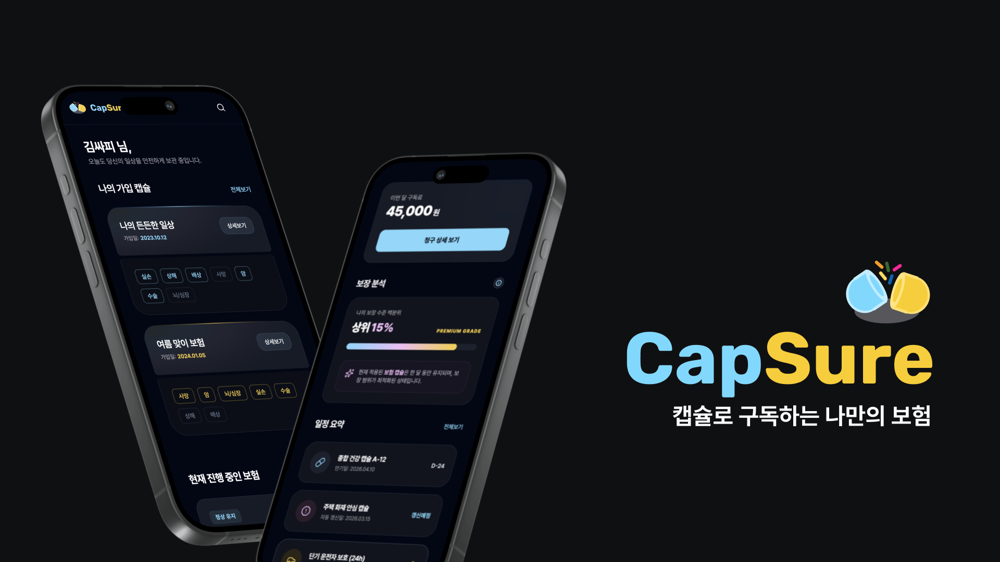

## 🎉 프로젝트 소개
> "캡슐로 구독하는 나만의 보험, CapSure"

넷플릭스도, 쇼핑도, 커피도 구독하는 시대. 그런데 왜 **'보험'만큼은** 10년, 20년씩 꽉 묶여 매달 큰돈을 내야만 할까요?

**CapSure**는 이 불편함을 해결하기 위해 탄생했습니다. 별도의 갱신 과정 없이 **월 단위로 자동 갱신**되고, 내 상황에 맞춰 필요한 보장만 **캡슐 단위로 자유롭게 선택**할 수 있습니다.

불필요한 특약 없이 내게 꼭 필요한 보장만 조립하고, 방대한 약관은 **AI가 핵심만 요약**하여 제공합니다. 실제 마이데이터 규격을 적용한 보험사 플랫폼에서 진정한 **구독형 보험 경험**을 만나보세요.

---

## 🎉 프로젝트 기간
2026.02.09 ~ 2026.04.03 (7주)

---

## 🎉 주요 기능
### 1. 캡슐형 구독 보험
> 핵심 기술: **Spring Boot, PostgreSQL, MyBatis**
- **카테고리별 보험 상품 탐색**
    - 복잡한 보험 상품을 카테고리별로 조회하고, 원하는 구독료 범위 내에서 자유롭게 필터링
    - 특정 보험 클릭 시 보장 내용을 한눈에 확인 가능
- **캡슐 담기 & 월 구독 구성**
    - 필요한 보장만 골라 하나의 캡슐로 담아 쉽게 가입
    - 불필요한 특약 없이 내 상황에 맞는 보장만 조립
- **월 단위 자동 갱신 & 보장 변경**
    - 별도 갱신 과정 없이 월 단위 자동 구독 유지
    - 익월 보장 변경 예약 및 실시간 보험료 산출

### 2. AI 약관 요약
> 핵심 기술: **GPT/Gemini API, 프롬프트 엔지니어링**
- **LLM 기반 약관 핵심 요약**
    - 수백 페이지에 달하는 보험 약관 PDF에서 핵심 4대 항목(보장, 부지급, 보험료, 기간) 자동 추출 및 요약
    - 전문 용어의 장벽 없이 가입에 필요한 핵심 내용을 한눈에 파악 가능

### 3. 보험 데이터 수집 및 통합 관리
> 핵심 기술: **Python, PostgreSQL**
- **생명·손해보험 협회 공시 데이터 수집**
    - 보험업법 제124조에 따라 협회 공시실에 등재된 실제 보험 데이터 수집
    - 서비스 타겟에 맞는 보험 20종, 총 1,667개 상품 데이터 확보
- **통합 데이터 표준화**
    - 생명보험(35컬럼)·손해보험(21컬럼)의 이기종 데이터를 공통 11항목 기준으로 45컬럼 통합 스키마로 정규화
    - 주계약 + 특약 포함 총 9,400개 상품을 단일 데이터로 관리

### 4. 감사 로깅 시스템
> 핵심 기술: **Transactional Outbox Pattern, MDC**
- **Transactional Outbox 패턴 기반 설계**
    - 비즈니스 데이터와 감사 로그를 하나의 트랜잭션으로 묶어 데이터 불일치 원천 차단
    - 별도 비동기 워커가 로그를 처리하여 성능과 안정성을 동시에 확보
- **MDC 기반 식별자 전파**
    - `requestId`·`userId`를 비동기 환경에서도 유지하여 멀티스레드 환경의 전체 요청 흐름 추적 가능
- **민감정보 자동 마스킹 & DLQ 재처리**
    - 객체 생성 단계에서 개인정보를 자동 마스킹하여 개발자 실수와 무관하게 보안 보장
    - 로그 적재 실패 시 DLQ(Dead Letter Queue) 저장으로 데이터 유실 없이 재처리

---

## 📁 CapSure 프로젝트 폴더 구조

<b>📦 S14P21A308 (Root)</b>

<pre>
├── 📄 .gitlab-ci.yml
├── 📄 .gitignore
├── 📄 README.md
├── 📁 Backend/
├── 📁 Frontend/
├── 📁 Infra/
├── 📁 Mock/
├── 📁 AiGuideLine/
└── 📁 docs/
</pre>

<b>📂 Backend</b> - Spring Boot 백엔드

<pre>
├── 📄 Dockerfile
├── 📄 build.gradle
├── 📄 settings.gradle
├── 📄 gradlew / gradlew.bat
├── 📄 docker-compose.local.yml
├── 📄 insurance.py           ← 보험 데이터 수집/파싱 스크립트
└── 📁 src/
</pre>

<b>📂 src/main/java/com/capsule/insurance</b> - 도메인 계층

<b>🔐 auth</b> - 인증/인가 (JWT, 회원가입, 로그인)

<pre>
├── api/          ← Controller (REST 엔드포인트)
├── application/  ← Service (비즈니스 로직)
├── domain/       ← Entity, Enum
├── dto/          ← Request / Response DTO
└── infra/        ← Repository, Mapper
</pre>

<b>💊 subscription</b> - 캡슐 구독 보험 (핵심 도메인)

<pre>
├── api/          ← SubscriptionController
├── application/  ← SubscriptionService
├── domain/       ← Subscription, SubscriptionItem, SubscriptionStatus
├── dto/          ← SubscriptionDetailResponse, ReserveNextItemRequest 등
└── infra/        ← SubscriptionMapper, SubscriptionRepository
</pre>

<b>📊 analysis</b> - 보장 분석 (진단 리포트, 백분위)

<pre>
├── api/
├── application/
├── domain/
├── dto/
└── infra/
</pre>

<b>📈 dashboard</b> - 대시보드 (월간 구독료, 결제 일정)

<pre>
├── api/
├── application/
├── domain/
├── dto/
└── infra/
</pre>

<b>🏦 insurer</b> - 보험사 상품 관리 (캡슐 상품, 약관)

<pre>
├── api/
├── application/
├── domain/
├── dto/
└── infra/
</pre>

<b>🔗 mydata</b> - 마이데이터 연동 (Mock 보험 API)

<pre>
├── api/
├── application/
├── domain/
├── dto/
└── infra/
</pre>

<b>📋 compliance</b> - 약관/규정 관리

<pre>
├── api/
├── application/
├── domain/
├── dto/
└── infra/
</pre>

<b>📝 audit</b> - 감사 로깅 (Transactional Outbox)

<pre>
├── api/
├── application/
├── domain/
├── dto/
└── infra/
</pre>

<b>⚙️ common</b> - 공통 모듈

<pre>
├── config/       ← SecurityConfig, SwaggerConfig, WebConfig 등
├── exception/    ← GlobalExceptionHandler, CustomException
├── logging/      ← MDC 기반 로깅, 마스킹 처리
├── response/     ← ApiResponse
├── security/     ← JWT 필터, UserDetails
└── util/         ← 유틸리티 클래스
</pre>

<b>📂 src/main/resources</b>

<pre>
├── application.yml
├── application-main.yml
├── application-mock.yml
├── logback-spring.xml
├── db/           ← SQL 초기화 스크립트
└── mapper/       ← MyBatis XML Mapper
</pre>

<b>📂 Frontend</b> - React 프론트엔드

<pre>
├── 📄 package.json
├── 📄 vite.config.js
└── 📁 src/
    ├── App.jsx
    ├── index.jsx
    ├── assets/        ← 이미지, 아이콘 등 정적 자원
    ├── styles/        ← 전역 CSS
    ├── layouts/       ← 공통 레이아웃 컴포넌트
    ├── common/        ← 공용 컴포넌트, API 클라이언트, 유틸
    │   ├── api/
    │   ├── components/
    │   ├── router/
    │   └── utils/
    └── features/      ← 기능별 모듈
        ├── auth/          ← 로그인, 회원가입
        ├── onboarding/    ← 디지털 인감, 마이데이터 동의
        ├── home/          ← 홈 화면
        ├── dashboard/     ← 보험 대시보드
        ├── capsure/       ← 캡슐 보험 가입/관리
        ├── mypage/        ← 마이페이지, 구독 현황
        └── search/        ← 보험 상품 검색
</pre>

<b>📂 Infra</b> - 인프라 설정

<pre>
├── main/
│   ├── docker-compose.yml      ← 메인 서버 (BE + DB + Promtail)
│   └── promtail-config.yaml
├── mock/
│   └── (Mock 서버 관련 설정)
├── mock-test/
│   └── (Mock 서버 테스트 환경)
├── main-test/
│   └── (메인 서버 테스트 환경)
└── monitor/
    ├── docker-compose.yml      ← Loki + Prometheus + Grafana
    ├── prometheus.yml
    ├── promtail-config.yaml
    ├── alert-rules.yml
    ├── conf/                   ← Loki 설정
    └── grafana/                ← Grafana 대시보드 JSON
</pre>

<b>📂 Mock</b> - Mock 마이데이터 서버

<pre>
└── Dockerfile
</pre>

---

## 👥 팀원 소개

<table>
  <tr>
    <td align="center" width="150" height="160" style="padding: 0;">
      
    </td>
    <td align="center" width="150" height="160" style="padding: 0;">
      
    </td>
    <td align="center" width="150" height="160" style="padding: 0;">
      
    </td>
    <td align="center" width="150" height="160" style="padding: 0;">
      
    </td>
    <td align="center" width="150" height="160" style="padding: 0;">
      
    </td>
  </tr>
  <tr>
    <td align="center" width="150" height="60">
      <b>정정교</b> 
      <a href="https://github.com/junggyo1020">@junggyo1020</a>
    </td>
    <td align="center" width="150" height="60">
      <b>곽영헌</b> 
      <a href="https://github.com/YoungHoney">@YoungHoney</a>
    </td>
    <td align="center" width="150" height="60">
      <b>서민재</b> 
      <a href="https://github.com/seomj">@seomj</a>
    </td>
    <td align="center" width="150" height="60">
      <b>유다현</b> 
      <a href="https://github.com/Dahyeonni">@Dahyeonni</a>
    </td>
    <td align="center" width="150" height="60">
      <b>전주현</b> 
      <a href="https://github.com/kr-nius">@kr-nius</a>
    </td>
  </tr>
  <tr>
    <td align="center" width="150" height="60">
      PM / BE
    </td>
    <td align="center" width="150" height="60">
      BE Lead
    </td>
    <td align="center" width="150" height="60">
      INFRA Lead
    </td>
    <td align="center" width="150" height="60">
      FE Lead
    </td>
    <td align="center" width="150" height="60">
      BE
    </td>
  </tr>
  <tr>
    <td align="left" width="150" valign="top" style="padding: 10px; font-size: 12px; line-height: 1.5;">
      • <b>구독 상세</b> 가입 캡슐 조회 
      • <b>구독 변경</b> 예약/확정/취소 
      • <b>시스템 로그</b> 비즈니스/예약 
      • <b>마이페이지</b> 프로필 조회/수정
    </td>
    <td align="left" width="150" valign="top" style="padding: 10px; font-size: 12px; line-height: 1.5;">
      • <b>대시보드</b> 구독료/진단 
      • <b>구독 편집</b> 보험 조회/취소 
      • <b>마이데이터</b> Mock API 5종 
      • <b>약관 요약</b> LLM 기반 
      • <b>마이페이지</b> 정산 요약
    </td>
    <td align="left" width="150" valign="top" style="padding: 10px; font-size: 12px; line-height: 1.5;">
      • <b>서버 구성</b> AWS EC2 
      • <b>CI/CD</b> GitLab Runner 
      • <b>배포</b> Main / Mock 분리 
      • <b>모니터링</b> Loki/Grafana
    </td>
    <td align="left" width="150" valign="top" style="padding: 10px; font-size: 12px; line-height: 1.5;">
      • <b>보험 Pool</b> 상품 목록/상세 
      • <b>결제</b> 처리/결과/내역 
      • <b>구독 확정</b> 캡슐 확정 
      • <b>보험 DB</b> 1,667개 정규화
    </td>
    <td align="left" width="150" valign="top" style="padding: 10px; font-size: 12px; line-height: 1.5;">
      • <b>온보딩</b> 디지털 인감 
      • <b>인증</b> 로그인/JWT/이메일 
      • <b>대시보드</b> 보험 보관함 
      • <b>회원</b> 가입/탈퇴 
      • <b>시스템 로그</b> 트랜잭션
    </td>
  </tr>
</table>

---

## 협업 방식

1. Git
   - [Git Convention](https://www.notion.so/Git-Convention-2e765a678df980e99afbf329f2246cc6?source=copy_link)
   - [Code Convention](https://www.notion.so/Code-Convention-2e765a678df98049b774fd0422b5061e?source=copy_link)
   - Mattermost 웹 훅 연동으로 당일 Issue 및 Merge Request 관리
  
2. Jira
   - 작업 단위에 따라 `Epic-Story-Task` 분류
   - 매주 목표량을 설정하여 Sprint 진행
   - 업무의 할당량을 정하여 `Story Point`를 설정하고, In-Progress -> Done 순으로 작업
  
3. Notion
   - 회의록 기록하여 보관
   - 컨벤션, 트러블 슈팅, 개발 산출물 관리
   - GANTT CHART 관리 
  
4. 회의
   - 데일리스크럼 매일 오전 9시 전날 목표 달성량과 당일 업무 브리핑
   - 문제상황 1시간 이상 지속 시 MatterMost 메신저를 활용한 공유 및 도움 요청  

---

## 산출물
### - [기능 정의서](https://rowan-octopus-031.notion.site/31865a678df980c5bff7cfca7fab3f3f?source=copy_link)

### - [PRD](https://rowan-octopus-031.notion.site/PRD-31865a678df98097aa50fdb334c85a09?source=copy_link)

### - [API 명세서](https://rowan-octopus-031.notion.site/API-31165a678df98037ad96c5d03b70b1a7?source=copy_link)

### - [ERD](https://www.erdcloud.com/d/gorbaQ4dTgrtFsQv7)

### - Infra Architecture

---

## 결과물
- [포팅메뉴얼]()
- [중간발표자료]()
- [최종발표자료]()

---

## 화면 구성

### 1. 회원가입 / 로그인
| 회원가입 | 로그인 |
| :---: | :---: |
| 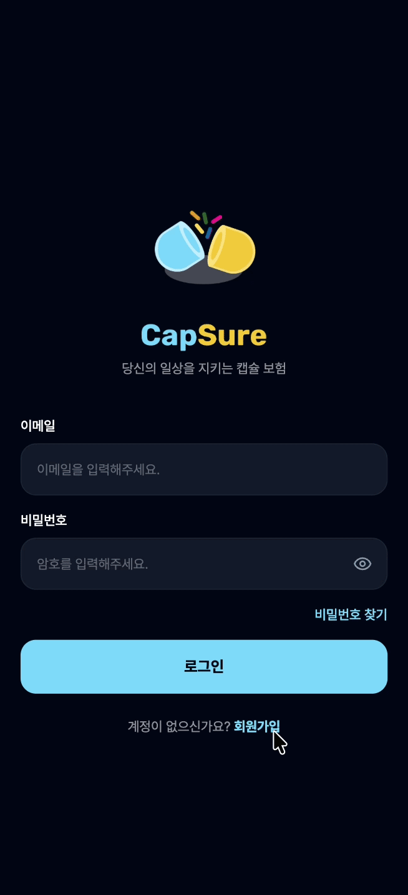 | 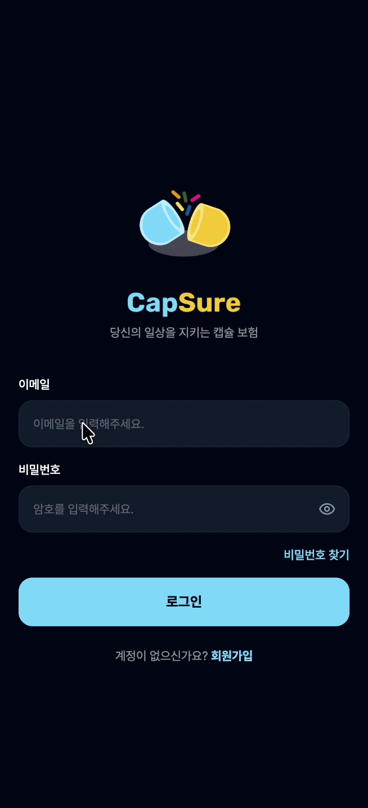 |

### 2. 온보딩 (디지털 인감 & 마이데이터)
| 디지털 인감 생성 | 마이데이터 동의 | 카테고리 선택 |
| :---: | :---: | :---: |
| 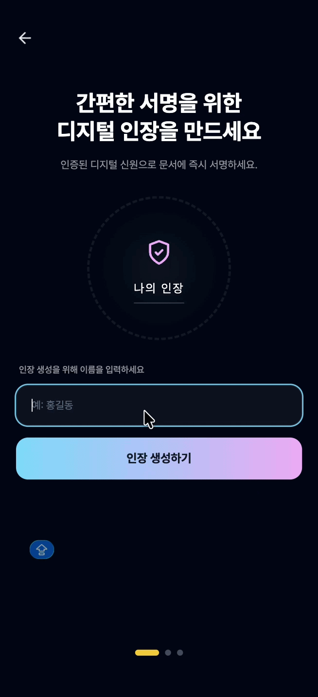 | 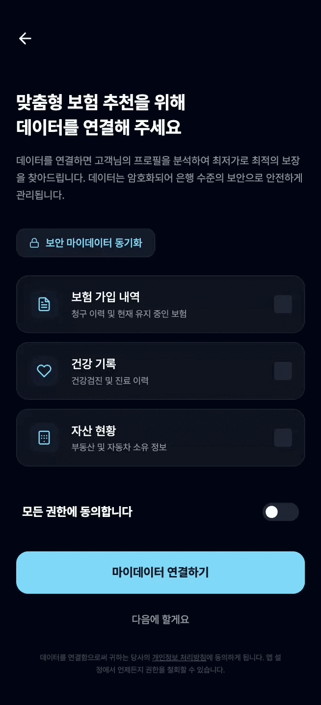 | 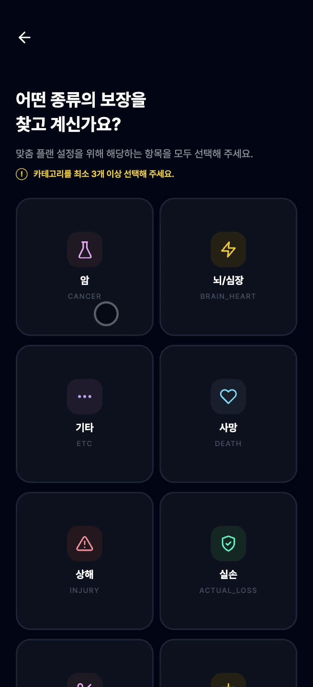 |

### 3. 대시보드 (보험 보관함)
| 보험 캡슐 대시보드 | 진단 리포트 |
| :---: | :---: |
|  | 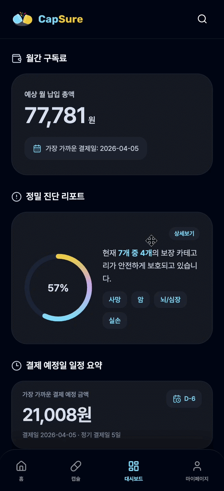 |

### 4. 캡슐 보험 가입
| 보험 상품 탐색 | 캡슐 담기 | 약관 AI 요약 |
| :---: | :---: | :---: |
| 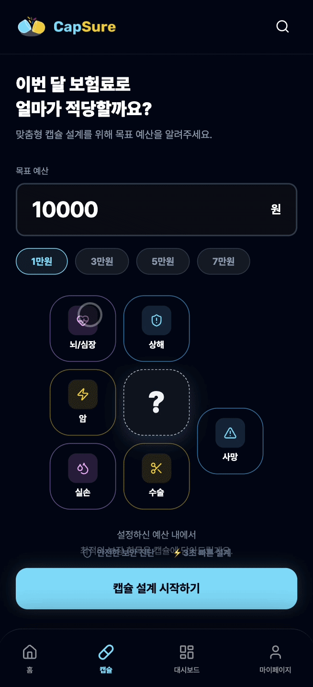 | 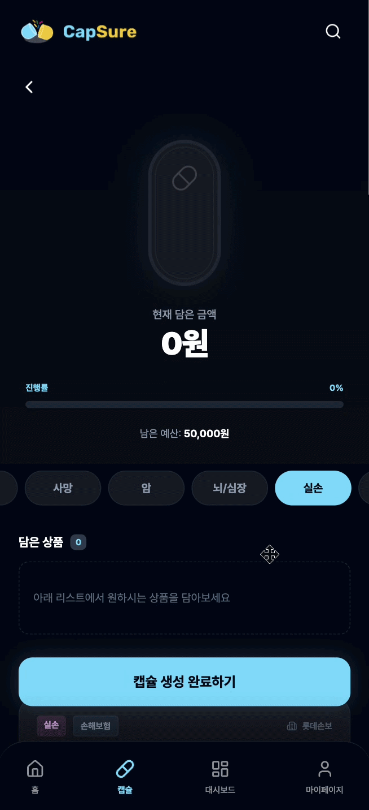 | 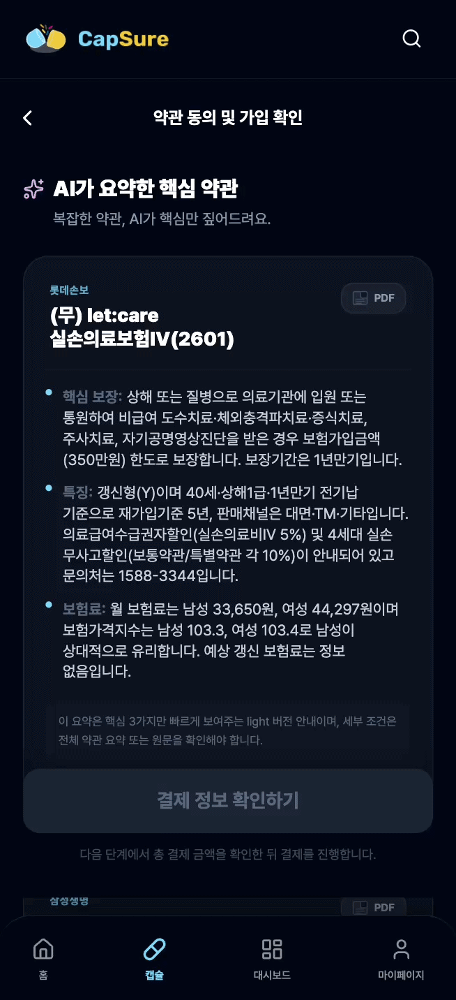 |

### 5. 구독 변경 (익월 예약)
| 보험 변경 예약 |
| :---: |
| 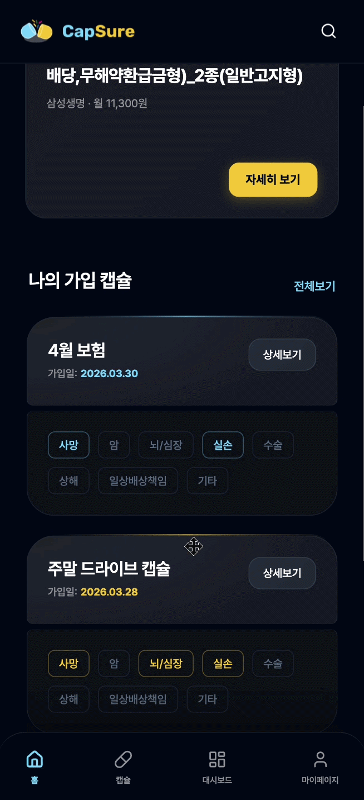 |

### 6. 결제
| 구독 결제 | 결제 내역 |
| :---: | :---: |
| 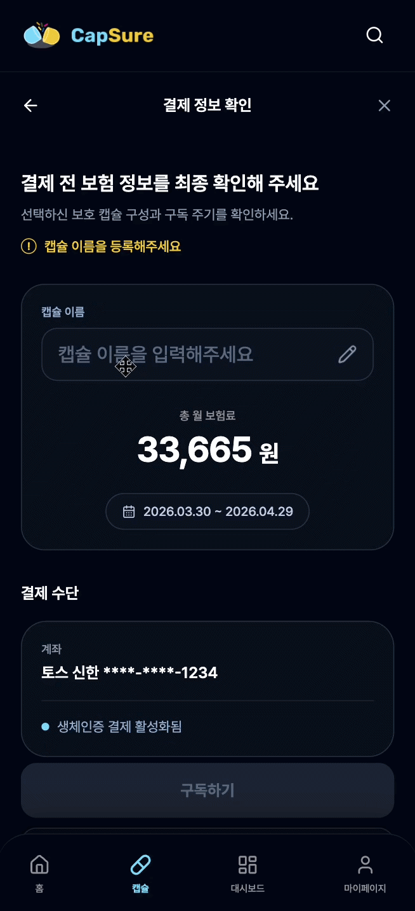 | 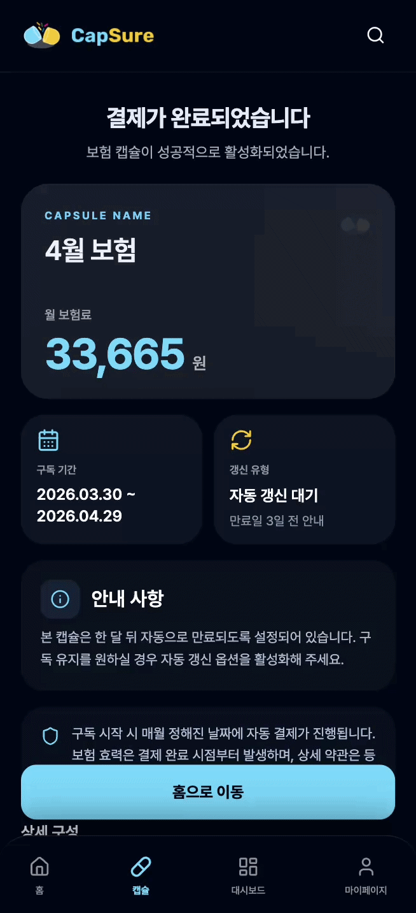 |

### 7. 마이페이지
| 구독 현황 | 정산 요약 |
| :---: | :---: |
| 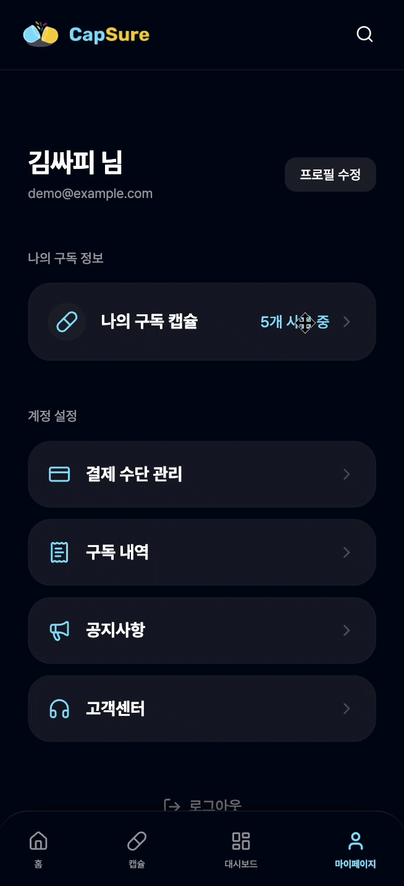 | 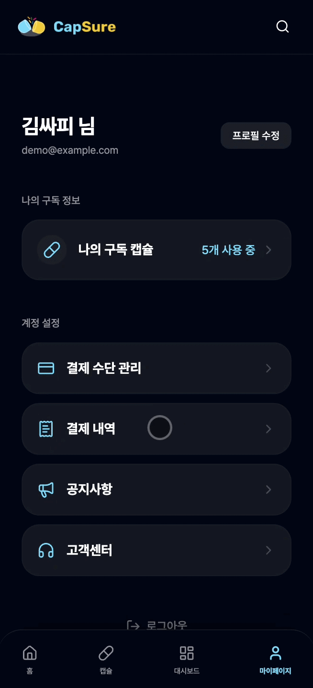 |
