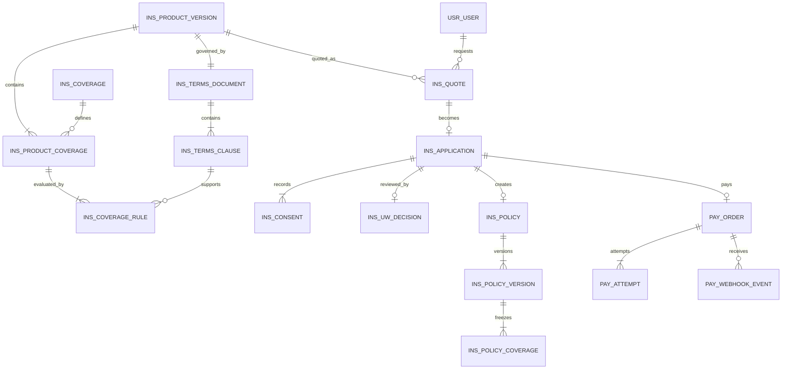
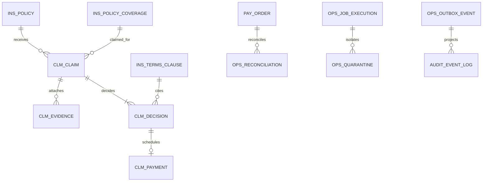

# CapSure 암보험 금융 프로세스 MVP 합의 설계 v1

- 상태: 사용자 범위 합의 완료, 구현 전 설계
- 합의일: 2026-09-01
- 기준 커밋: `64211b428b59618dffc391a9ebafffc78d573249`
- 구현 기간: 7일
- 기준 저장소: `/Users/dahyeon/.codex/worktrees/7bac/CapSure`
- 제품 경계: 실제 보험 판매·의학적 판단·실제 보험금 송금이 아닌 교육·포트폴리오용 시뮬레이션

## 1. 한 문장 목표

암보험의 약관을 생활 상황과 원문 근거로 이해하고, 청약·인수심사·초회 보험료·계약·암 진단비 청구·지급심사까지 경험하면서 중복 요청과 외부 장애에도 계약과 돈의 상태가 일치하는 금융 백엔드를 구현한다.

## 2. 제품과 포트폴리오의 이중 가치

### 사용자 가치

사용자는 다음 질문에 스스로 답할 수 있어야 한다.

1. 내가 가입한 담보가 무엇인지
2. 언제부터 보장되는지
3. 어떤 암이 어떤 담보로 분류되는지
4. 어떤 서류를 준비해야 하는지
5. 지급·부지급·추가심사 결과의 근거가 무엇인지

`보험을 즐긴다`는 의미는 질병을 게임화하는 것이 아니다. 복잡한 보험을 탐색하고 이해하는 부담을 줄이며, 계약과 청구 상태를 사용자가 통제할 수 있게 한다는 의미로 정의한다.

### 채용 포트폴리오 가치

다음 하나의 문제 해결 서사를 만든다.

> 담보 행을 상품처럼 취급하고 결제 없이 즉시 구독을 활성화하던 데모를 분석했다. 이후 암보험 상품·약관을 유효기간이 있는 버전으로 재구성하고, 청약–인수심사–보험료 수납–계약–보험금 지급심사 상태 머신을 구현했다. 멱등성, Outbox, 대사 배치, 체크포인트 재시작을 적용해 중복 요청·웹훅 재전송·결제 타임아웃·배치 중단 상황에서도 계약과 금전 상태의 정합성을 자동화 테스트로 검증했다.

이 문장은 구현과 측정이 완료되기 전까지 목표 문장일 뿐 성과 주장으로 사용하지 않는다.

## 3. 합의된 범위

### Must — 7일 안에 반드시 완성

- 교육용 가상 암보험 1개와 판매 버전 1개
- 일반암 진단비, 유사암·소액암 진단비, 암 수술비의 담보 3개
- 핵심 약관 조항 10~15개와 생활 상황 3개
- 상품–담보 계층과 보험료 중복 합산 제거
- 견적 불변 스냅샷
- 고지사항, 약관 동의, 자동 인수심사
- Toss 테스트 일반결제를 이용한 초회 보험료 수납
- 계약 발행과 담보별 보장개시일
- 암 진단비 청구, 증빙, 지급·부지급·수동심사 결정
- 가상 보험금 지급 원장
- 멱등성, 웹훅 중복 방지, `UNKNOWN` 결제 대사
- Transactional Outbox와 감사 타임라인
- 상품 적재 배치의 격리·대사·재시작
- 핵심 E2E 및 장애 주입 테스트

### Should — Must 완료 후 추가

- 다음 보험료 수납 일정과 Fake Billing 실패·재시도
- 운영자용 결제·청구·배치 대시보드
- 사용자 청구 준비도 체크리스트 UI
- 약관 조항 검색과 보장 타임라인 시각화

### Later — 이번 주 제외

- Toss live 결제와 live 자동결제
- 실제 보험금 계좌 송금
- IBK·금융결제원 오픈뱅킹 운영 연동
- 실제 의료정보·진단서·주민등록번호 저장
- OCR과 의료 AI 판정
- 실제 보험료 위험률·사업비·해약환급금 계리 산출
- 전 보험사 암보험 비교
- IFRS17, 책임준비금, 재보험, 설계사 수수료 원장
- Kafka, 마이크로서비스, 별도 데이터웨어하우스

## 4. 현재 시스템에서 바꿀 핵심

현재 확인된 원천은 담보성 행 9,675개, 회사–상품 쌍 1,617개이며 복수 담보 행을 가진 상품이 1,533개다. 현재 채널은 `product_source` 행을 구매 단위처럼 사용하고 선택 즉시 `ACTIVE` 구독을 만든다.

목표 구조에서는 다음을 지킨다.

| 현재 | 목표 |
| --- | --- |
| `product_source` 행이 상품 카드 | `product_source`는 원천/landing, 판매 단위는 `product_version` |
| 담보 행마다 보험료 합산 가능 | 상품 버전의 가입 구성에서 보험료를 한 번 계산 |
| 선택 즉시 `subscription.ACTIVE` | 청약·심사·초회 보험료 후 `policy.ACTIVE` |
| 프런트 체크박스 동의 | 문서 버전·해시·시각이 있는 동의 증거 |
| 컬럼 기반 AI 약관 요약 | 약관 조항–설명–상황–원문 근거 연결 |
| 결제수단 존재 확인 | 결제 주문–시도–승인–대사 원장 |
| 지급심사 없음 | 계약 당시 약관 버전으로 진단비 심사 |
| scheduler가 바로 갱신 | job 실행·선점·재시도·대사·DLQ 기록 |

## 5. 실제 보험 업무와 시스템 계층

업무 축과 시스템 축을 섞지 않는다.

- 은행 업무: 수신, 여신, 카드, 외환
- 보험 업무: 상품, 신계약, 인수심사, 계약관리, 보험료 수납, 보험금 지급심사
- 시스템 계층: 채널계, 인터페이스계, 기간계, 정보계, 운영·통제계

```text
[채널계]
고객 Web · 관리자 화면
        │
        ▼
[MCI/API Gateway 성격]
인증 · 권한 · 요청 ID · 공통 오류 · 입력 검증
        │
        ▼
[보험 기간계]
상품/약관 → 견적 → 청약 → 인수심사 → 계약
                                     │
                  보험료 수납 ← 결제 │ 보험금 청구 → 지급심사 → 지급원장
        │
        ▼
[인터페이스계]
TossPaymentAdapter · FakePayoutAdapter · 향후 IBK/KFTC Adapter
        │
        ▼
[운영·통제계]
Outbox · Batch · Reconciliation · Retry · DLQ · Audit
        │
        ▼
[정보계]
고객 타임라인 · 운영 대시보드 · 검증 지표 · Read Model
```

MCI, EAI, ESB, FEP의 정확한 명칭과 경계는 보험사마다 다르다. CapSure에서는 역할만 재현하고 특정 회사의 내부 구성을 모사했다고 표현하지 않는다.

## 6. Bounded Context와 책임

| Context | 책임 | 소유 데이터 | 외부로 제공하는 것 |
| --- | --- | --- | --- |
| Catalog | 상품·판매버전·담보·보험료 구성 | product version, coverage | 판매 가능한 상품 snapshot |
| Terms | 약관 문서·조항·설명·지급 규칙 | terms document/clause/rule | 조항 근거와 규칙 버전 |
| Quote | 가입 구성과 금액 동결 | quote snapshot | 유효한 견적 |
| Application | 청약, 고지, 동의 | application, disclosure, consent | 제출된 청약 |
| Underwriting | 인수 가능성 판단 | decision, rule/input hash | 승인·수동심사·거절 |
| Policy | 보험계약과 담보 유효기간 | policy/version/coverage | 사고일 기준 계약 snapshot |
| Billing | 보험료 회차와 납입 의무 | billing schedule | 수납 대상 회차 |
| Payment | 외부 결제 상태와 수납 원장 | order/attempt/webhook | 확정된 수납 결과 |
| Claim | 보험금 청구·증빙·지급심사 | claim/evidence/decision | 지급·부지급·수동심사 |
| Integration | 외부사 DTO와 오류 번역 | adapter request metadata | 내부 port 구현 |
| Operations | 배치·대사·Outbox·감사 | job/outbox/quarantine | 재처리 가능한 운영 상태 |
| Information | 화면과 통계용 조회 | projections | 원장을 수정하지 않는 조회 |

DDD는 패키지 이름이 아니라 각 Context가 자기 용어, 데이터, 불변식, 상태 전이를 소유하는 것으로 판정한다.

## 7. 대표 사용자 흐름

### 가입 흐름

```text
상품 조회
→ 상품 버전과 담보 3개 확인
→ 30초 약관/상황/원문 확인
→ 서버 견적 생성
→ 고지사항 입력
→ 약관 버전 동의
→ 청약 제출
→ 자동 인수심사
→ 승인 시 초회 보험료 주문 생성
→ Toss 인증
→ 서버 금액 검증 및 승인
→ 계약 발행
→ 담보별 보장개시일 계산
→ 고객 타임라인 갱신
```

### 청구 흐름

```text
보유 계약 선택
→ 진단일과 청구 담보 선택
→ 가상 진단 증빙 제출
→ 필요한 서류 검사
→ 사고일 기준 계약/약관 버전 복원
→ 지급 규칙 평가
→ 지급 | 부지급 | 수동심사
→ 조항 근거와 이유 제시
→ 승인 건의 가상 보험금 지급 원장 기록
→ 고객 타임라인 갱신
```

현재 계약 상태가 실효되었더라도 사고일 당시 담보가 유효했다면 청구 검토 대상일 수 있다. 따라서 지급심사는 현재 상태만 보지 않고 사고일 기준 계약 버전을 조회한다.

## 8. 상태 전이

### Quote

```text
DRAFT → ISSUED → USED
              ↘ EXPIRED
              ↘ CANCELED
```

### Application

```text
DRAFT
→ DISCLOSURE_COMPLETED
→ SUBMITTED
→ UNDER_REVIEW
→ APPROVED | MANUAL_REVIEW | DECLINED | WITHDRAWN
```

### Payment

```text
CREATED
→ AUTHENTICATED
→ APPROVING
→ PAID | FAILED | EXPIRED | UNKNOWN

UNKNOWN → PAID | FAILED       # PG 조회·웹훅·대사로만 확정
PAID → CANCEL_PENDING → CANCELED | PARTIALLY_CANCELED
```

브라우저의 성공 URL은 인증 결과일 뿐 결제·계약 완료의 근거가 아니다.

### Policy

```text
PENDING_INITIAL_PREMIUM
→ ACTIVE
→ GRACE | CHANGE_SCHEDULED | CANCELED | LAPSED | EXPIRED

CHANGE_SCHEDULED → ACTIVE(new policy_version)
GRACE → ACTIVE | LAPSED
```

### Claim

```text
DRAFT
→ DOCUMENTS_PENDING
→ SUBMITTED
→ ASSESSING
→ APPROVED | MANUAL_REVIEW | DENIED

APPROVED → PAYMENT_SCHEDULED → PAID | PAYMENT_FAILED
MANUAL_REVIEW → ASSESSING | APPROVED | DENIED
```

## 9. 핵심 불변식

### 상품·약관

1. 판매된 상품 버전과 약관은 덮어쓰지 않는다.
2. 견적은 `product_version`, 선택 담보, 보험료, 약관 해시를 snapshot으로 보관한다.
3. 원천 담보 행 수와 판매 상품 수를 같은 지표로 사용하지 않는다.
4. AI 설명은 약관 원문보다 우선하지 않으며 근거가 없으면 `확인 불가`를 반환한다.

### 청약·계약

1. 고지와 필수 동의가 완료되지 않은 청약은 제출할 수 없다.
2. 인수 승인 전에는 초회 보험료 수납을 시작하지 않는다.
3. 인수 승인과 초회 보험료 `PAID`가 모두 없으면 계약을 `ACTIVE`로 만들지 않는다.
4. 승인된 청약 하나에는 활성 계약이 최대 하나다.
5. 계약 변경은 기존 버전 수정이 아니라 새 `policy_version`을 생성한다.

### 결제

1. 결제 금액은 브라우저 값이 아니라 서버의 견적 snapshot으로 검증한다.
2. 하나의 업무 주문에는 하나의 `payment_order`가 있고 외부 호출마다 `payment_attempt`가 생긴다.
3. 같은 idempotency key의 재요청은 동일 결과를 반환하고 외부 승인 호출을 중복하지 않는다.
4. `UNKNOWN`은 실패가 아니므로 새 주문을 만들기 전에 대사한다.
5. webhook event ID는 고유해야 하며 재전송은 상태를 다시 전이시키지 않는다.

### 지급심사

1. 지급심사는 사고일 기준 `policy_version`, `policy_coverage`, `terms_document`, `coverage_rule`을 사용한다.
2. 담보별 보장개시일 이전 사고는 해당 규칙에 따라 부지급 또는 수동심사한다.
3. 증빙 부족과 규칙 미확정은 자동 부지급이 아니라 `MANUAL_REVIEW`로 보낸다.
4. AI는 지급 결정을 생성하지 않는다.
5. 모든 지급·부지급 결정은 조항 ID, 규칙 버전, 입력 해시를 가진다.
6. 동일 지급 결정에는 가상 보험금 지급 원장이 최대 하나다.

### 운영

1. 코어 상태 변경과 Outbox 저장은 같은 로컬 DB 트랜잭션에서 처리한다.
2. worker는 처리권을 선점하고 같은 이벤트를 동시에 처리하지 않는다.
3. 재시도 가능한 기술 오류와 재시도하면 안 되는 업무 오류를 분리한다.
4. 정보계와 대시보드는 코어 원장을 직접 수정하지 않는다.

## 10. 논리 ERD

### 상품·청약·계약·수납



### 보험금 청구·운영



### 핵심 테이블과 키

| 테이블 | 핵심 컬럼 | 주요 제약 |
| --- | --- | --- |
| `ins_product_version` | product_code, version, sale_from/to, status | `(product_code, version)` unique |
| `ins_coverage` | coverage_code, name, benefit_type | coverage_code unique |
| `ins_product_coverage` | product_version_id, coverage_id, insured_amount | `(product_version_id, coverage_id)` unique |
| `ins_terms_document` | document_version, source_uri, source_hash | source_hash immutable |
| `ins_terms_clause` | document_id, clause_code, title, body, page | `(document_id, clause_code)` unique |
| `ins_coverage_rule` | product_coverage_id, rule_version, rule_json, clause_id | version immutable |
| `ins_quote` | user_id, product_version_id, premium, snapshot_json, expires_at | 사용 후 수정 금지 |
| `ins_application` | quote_id, status, disclosure_json, submitted_at | quote_id unique |
| `ins_consent` | application_id, document_id, document_hash, agreed_at | 필수 동의 종류별 unique |
| `ins_uw_decision` | application_id, decision, rule_version, input_hash | application_id + decision_version unique |
| `ins_policy` | application_id, policy_no, status | application_id unique, policy_no unique |
| `ins_policy_version` | policy_id, version, valid_from/to, snapshot_json | `(policy_id, version)` unique |
| `ins_policy_coverage` | policy_version_id, coverage_id, coverage_start/end | version별 담보 unique |
| `pay_order` | business_key, amount, status | business_key unique |
| `pay_attempt` | order_id, attempt_no, idempotency_key, provider_key | idempotency_key unique |
| `pay_webhook_event` | provider_event_id, payload_hash, received_at | provider_event_id unique |
| `clm_claim` | policy_id, policy_coverage_id, incident_at, status | claim_no unique |
| `clm_evidence` | claim_id, type, synthetic_ref, checksum | 실제 의료파일 저장 금지 |
| `clm_decision` | claim_id, result, amount, clause_id, input_hash | `(claim_id, decision_version)` unique |
| `clm_payment` | decision_id, amount, status | decision_id unique |
| `ops_outbox_event` | aggregate_type/id, event_type, payload, status | event_id unique |
| `ops_job_execution` | job_name, instance_key, checkpoint, status | instance_key unique |
| `ops_quarantine` | execution_id, source_key, reason_code, raw_hash | 재처리 상태 기록 |

초기 구현에서는 기존 `audit_outbox`와 `audit_event_log`를 확장·재사용할 수 있다. 논리 이름과 실제 물리 테이블 이름의 매핑은 Day 1 migration ADR에서 고정한다.

## 11. API 계약 목록

API prefix는 `/api/v1`을 권장한다. 현재 endpoint와의 호환 adapter는 유지하되 신규 금융 흐름은 별도 resource로 만든다.

### 상품·약관·견적

| Method | Path | 책임 | 주요 결과 |
| --- | --- | --- | --- |
| GET | `/cancer-products` | 판매 가능한 상품 버전 조회 | 상품 1개, 담보 3개 |
| GET | `/cancer-products/{productVersionId}` | 상품·담보 상세 | 보험료 구성, 유효기간 |
| GET | `/cancer-products/{productVersionId}/terms/summary` | 30초 핵심 보기 | 핵심, 제외, 보장개시 |
| GET | `/cancer-products/{productVersionId}/terms/scenarios` | 생활 상황 3개 | 결과와 조항 근거 |
| GET | `/terms/clauses/{clauseId}` | 약관 원문 조회 | 문서 버전, 페이지, 원문 |
| POST | `/quotes` | 서버 견적 발행 | `quoteId`, premium, expiresAt |
| GET | `/quotes/{quoteId}` | 견적 snapshot 조회 | 사용·만료 상태 |

### 청약·인수

| Method | Path | 책임 | 주요 결과 |
| --- | --- | --- | --- |
| POST | `/applications` | 견적으로 청약 초안 생성 | `applicationId`, DRAFT |
| PUT | `/applications/{id}/disclosures` | 고지 답변 전체 교체 | DISCLOSURE_COMPLETED |
| POST | `/applications/{id}/consents` | 약관·설명서 동의 기록 | document hash |
| POST | `/applications/{id}/submit` | 청약 제출과 자동심사 요청 | APPROVED/MANUAL_REVIEW/DECLINED |
| GET | `/applications/{id}` | 청약·심사 타임라인 | 현재 상태와 이유 코드 |

청약 제출은 `Idempotency-Key`를 요구한다. 같은 키의 재요청은 동일 결과를 반환한다.

### 보험료 결제·계약

| Method | Path | 책임 | 주요 결과 |
| --- | --- | --- | --- |
| POST | `/applications/{id}/payment-orders` | 승인된 청약의 초회 보험료 주문 | orderId, amount |
| POST | `/payments/{orderId}/confirm` | 서버 검증 후 Toss 승인 | PAID/FAILED/UNKNOWN |
| POST | `/webhooks/toss/payments` | 웹훅 원본 저장·중복 방지 | 빠른 2xx |
| GET | `/payments/{orderId}` | 결제·대사 상태 조회 | provider/local 상태 |
| GET | `/policies/{policyId}` | 계약·담보·보장개시일 조회 | policy version |
| GET | `/policies/{policyId}/timeline` | 고객 계약 타임라인 | 감사 projection |

`confirm`은 브라우저의 amount를 신뢰하지 않는다. DB의 `payment_order.amount`와 대조한 뒤 승인한다.

### 보험금 청구·지급심사

| Method | Path | 책임 | 주요 결과 |
| --- | --- | --- | --- |
| POST | `/policies/{policyId}/claims` | 청구 초안 생성 | claimId, DRAFT |
| PUT | `/claims/{claimId}/evidence` | 가상 증빙 metadata 등록 | 충족·부족 서류 |
| POST | `/claims/{claimId}/submit` | 지급심사 제출 | ASSESSING |
| GET | `/claims/{claimId}` | 청구 상태와 준비도 | checklist, timeline |
| GET | `/claims/{claimId}/decision` | 지급심사 결과 | result, amount, clause |
| POST | `/claims/{claimId}/payments` | 승인 건 가상 지급 실행 | PAYMENT_SCHEDULED/PAID |

지급심사 제출과 가상 지급 실행도 각각 별도 idempotency key를 사용한다.

### 운영·정보계

| Method | Path | 책임 | 접근 |
| --- | --- | --- | --- |
| POST | `/ops/jobs/catalog-import` | 암보험 상품 적재 job 시작 | ADMIN |
| POST | `/ops/jobs/payment-reconciliation` | `UNKNOWN` 결제 대사 | ADMIN |
| GET | `/ops/job-executions/{id}` | checkpoint·대사·격리 조회 | ADMIN |
| POST | `/ops/outbox/{eventId}/replay` | DLQ 수동 재처리 | ADMIN + audit |
| GET | `/ops/dashboard` | 계약·결제·청구·배치 지표 | ADMIN |

### 공통 오류

| HTTP | errorCode 예 | 의미 |
| ---: | --- | --- |
| 400 | `INVALID_INPUT` | 형식·필수값 오류 |
| 401/403 | `UNAUTHORIZED`, `FORBIDDEN` | 인증·소유권·역할 오류 |
| 404 | `RESOURCE_NOT_FOUND` | 존재하지 않거나 접근 불가 |
| 409 | `INVALID_STATE_TRANSITION`, `IDEMPOTENCY_CONFLICT` | 상태·중복 충돌 |
| 422 | `BUSINESS_RULE_VIOLATION` | 업무 규칙상 처리 불가 |
| 202 | 정상 응답 + `UNKNOWN`/`MANUAL_REVIEW` | 비동기 확정 필요 |

## 12. 외부 연계 경계

```java
interface PremiumPaymentGateway {
    PaymentConfirmation confirm(ConfirmPaymentCommand command);
    PaymentInquiry inquire(String providerPaymentKey);
    PaymentCancellation cancel(CancelPaymentCommand command);
}

interface BenefitPayoutPort {
    PayoutResult pay(BenefitPayoutCommand command);
}
```

- `TossPaymentsAdapter`: 초회 보험료 수납 테스트용
- `FakePremiumPaymentGateway`: timeout, duplicate, failure 통합 테스트용
- `FakeBenefitPayoutAdapter`: 보험금 지급 원장 시뮬레이션용
- 향후 은행이체 adapter: 운영 계약과 보안 검토 후 별도 구현

Toss는 보험료를 받는 PG로 사용하며 보험금을 고객에게 송금하는 시스템으로 사용하지 않는다.

## 13. 약관 경험과 지급 규칙

### 세 단계 약관 화면

1. 30초 핵심: 보장 대상, 보장개시, 지급금액, 제외, 갱신
2. 생활 상황: 진단일·분류·증빙 조건에 따른 예시
3. 원문 근거: 문서 버전, 조항, 페이지, 출처, 원문

### 데모 상황 3개

| 시나리오 | 입력 | 기대 결과 |
| --- | --- | --- |
| A | 해당 담보 보장개시 후 일반암 진단, 필수 증빙 충족 | `APPROVED` |
| B | 암 담보 보장개시 전 진단 | 해당 약관 규칙에 따른 `DENIED` |
| C | 진단코드는 있으나 필수 확정 증빙 누락 | `MANUAL_REVIEW` |

보장개시 대기일, 감액기간, 지급금액은 특정 상품의 보편 규칙으로 단정하지 않는다. Day 1에 선택한 공개 약관 또는 명시적 가상 약관 fixture에서 값을 가져와 버전과 해시를 고정한다.

### Rule evaluation 입력

```text
policyVersionId
policyCoverageId
incidentAt
diagnosisCategory
diagnosisEvidenceTypes
priorBenefitHistory
termsDocumentHash
coverageRuleVersion
```

### Rule evaluation 출력

```text
result: APPROVED | MANUAL_REVIEW | DENIED
benefitAmount
reasonCodes[]
clauseIds[]
ruleVersion
inputHash
decidedAt
```

## 14. 배치·자동화·장애 복구

### Job A — CancerCatalogPublishJob

```text
product_source/raw fixture
→ staging
→ 형식 검증
→ 암 관련 행 필터
→ 회사·상품·버전·담보 mapping
→ 중복 판정
→ 오류 quarantine
→ chunk commit/checkpoint
→ control total 대사
→ product version publish
```

- job instance key: `sourceChecksum:mappingRuleVersion`
- 기본 chunk size: 100, 설정으로 변경 가능
- 동일 instance 재실행은 중복 발행하지 않는다.
- `input = accepted + duplicate + quarantined`를 검증한다.
- 동일 checksum 재실행 시 canonical row 증가는 0이어야 한다.

### Job B — PaymentReconciliationJob

- 오래된 `APPROVING`, `UNKNOWN`만 조회한다.
- PG 조회 결과로 `PAID`, `FAILED`, 계속 `UNKNOWN`을 확정한다.
- 동일 주문을 새로 만들지 않는다.
- 결제 확정과 계약 활성화 이벤트를 원자적으로 저장한다.

### Job C — OutboxRelay

- `FOR UPDATE SKIP LOCKED` 또는 동등한 선점 전략을 사용한다.
- 재시도 가능한 오류에만 backoff를 적용한다.
- 최대 재시도 후 DLQ로 이동한다.
- replay actor, time, reason을 감사한다.

### Job D — BillingScheduleCreator/Worker

Must가 완료된 경우에만 구현한다.

- unique key: `(policy_id, billing_cycle)`
- Fake adapter로 성공·일시 실패·최종 실패를 재현한다.
- 결제 실패를 곧바로 계약 실효로 만들지 않고 가상 유예 상태를 거친다.

## 15. 모듈러 모놀리스 패키지 목표

```text
com.capsule.insurance
├─ catalog
├─ terms
├─ quote
├─ application
├─ underwriting
├─ policy
├─ billing
├─ payment
├─ claim
├─ integration
│  ├─ tosspayments
│  └─ payout
├─ operations
├─ audit
└─ information
```

현재 `insurer`는 Catalog/Terms로 점진 이전하고, `subscription`의 즉시 활성화 흐름은 신규 Application/Policy 경로에서 사용하지 않는다. 기존 화면을 한 번에 제거하지 않고 신규 `/api/v1` 흐름이 완성된 뒤 호환 여부를 결정한다.

## 16. 7일 WBS

사용자가 하루 12시간 참여할 수 있더라도 순수 구현 12시간으로 계획하지 않는다. 매일 핵심 작업 8~9시간, 테스트·문서 2시간, 장애·휴식 buffer 1~2시간을 둔다. 전체 84시간 중 약 70시간을 계획하고 14시간을 buffer로 남긴다.

| 일차 | 핵심 작업 | 산출물 | 종료 조건 |
| --- | --- | --- | --- |
| Day 1 | 실행환경·동적 기준선, ADR, 가상 상품/약관 fixture, additive migration | baseline raw, schema/ADR, terms hash | 현재 테스트 결과와 신규 schema 검증, 상품·담보·약관 버전 고정 |
| Day 2 | Catalog/Terms, 상품–담보 grouping, import batch | 상품/약관 API, batch execution | 담보 N개가 상품 1개로 조회, 보험료 중복 0, restart/control total 통과 |
| Day 3 | Quote/Application/Consent/UW | 견적·청약 API와 상태 테스트 | 승인·수동심사·거절 fixture, 동의 version/hash 재현 |
| Day 4 | Toss test Payment, Policy, Outbox | 결제·계약 API, adapter contract | 중복 confirm 0, 실패/UNKNOWN ACTIVE 0, 성공당 policy 1 |
| Day 5 | Claim/Evidence/Assessment/Payout ledger | 청구 API, 규칙 engine | 3개 지급심사 시나리오와 조항 근거 통과 |
| Day 6 | webhook·reconciliation·DLQ·정보계·핵심 UI | 장애 복구 테스트, dashboard/timeline | timeout 복구, duplicate webhook 0, 사용자 전체 흐름 시연 |
| Day 7 | E2E·성능 기준선·문서·시연·경력 증거 | 테스트 raw, README, demo script, evidence ledger | 완료 기준 전체 확인, 측정되지 않은 성과 문장 0 |

### 일일 운영 리듬

```text
09:00~10:00  전날 결과와 실패 확인, 오늘 완료 조건 고정
10:00~13:00  첫 번째 구현 블록
14:00~18:00  두 번째 구현 블록
19:00~21:00  통합 테스트와 장애 시나리오
21:00~22:00  문서·증거·ARIA 체크포인트
나머지 시간   식사·휴식·예상 밖 장애 buffer
```

### 지연 시 제거 순서

다음 순서로 범위를 줄인다.

1. UI 애니메이션과 시각적 polish
2. 운영 대시보드 상세 차트
3. 정기 보험료 Fake Billing
4. 기존 endpoint 완전 마이그레이션
5. 약관 조항 수를 15개에서 핵심 10개로 축소

다음은 줄이지 않는다.

- 상품–담보 계층과 견적 snapshot
- 청약·인수·결제·계약 상태 불변식
- 결제 멱등성·UNKNOWN 대사
- 사고일 기준 약관 버전 지급심사
- 조항 근거와 `MANUAL_REVIEW`
- 배치 대사·재시작
- 핵심 자동화 테스트와 raw 결과 저장

## 17. 자동화 테스트와 완료 기준

| ID | 시나리오 | 완료 기준 |
| --- | --- | --- |
| CAT-001 | 담보 3개 상품 조회 | 상품 카드 1개, 담보 3개 |
| CAT-002 | 같은 import instance 재실행 | canonical 증가 0 |
| BAT-001 | 1개 chunk 후 강제 실패·재시작 | checkpoint 이후부터 완료, 중복 0 |
| BAT-002 | control total | input = accepted + duplicate + quarantine |
| TERMS-001 | 상황 답변 | 모든 결과에 clause ID와 document hash 존재 |
| APP-001 | 필수 고지 누락 제출 | 422, 상태 전이 없음 |
| APP-002 | 제출 100회 | 심사 실행과 최종 결과 1개 |
| UW-001 | 승인·수동·거절 fixture | 기대 결정 3개 일치 |
| PAY-001 | 동일 confirm 100회 | PG 승인 시도 1개, payment `PAID` 1개 |
| PAY-002 | 금액 위변조 | 외부 호출 0, 409/422 |
| PAY-003 | PG timeout | `UNKNOWN`, ACTIVE policy 0 |
| PAY-004 | 대사 결과 성공 | `PAID`, ACTIVE policy 정확히 1개 |
| PAY-005 | 동일 webhook 100회 | 상태 전이 1개 |
| POL-001 | 승인 없이 결제 시도 | 주문 생성 불가 |
| POL-002 | 결제 실패 | ACTIVE policy 0 |
| CLM-001 | 보장개시 후 일반암·증빙 충족 | APPROVED, 금액·조항 존재 |
| CLM-002 | 보장개시 전 진단 | DENIED, 이유·조항 존재 |
| CLM-003 | 증빙 부족 | MANUAL_REVIEW, 자동 부지급 없음 |
| CLM-004 | 현재 실효, 사고일 당시 유효 | 사고일 snapshot으로 심사 |
| CLM-005 | 동일 지급 실행 100회 | 지급 원장 1개 |
| AUD-001 | 핵심 상태 전이 | outbox와 audit projection 누락 0 |
| SEC-001 | 타 사용자 resource 접근 | 403/404, 데이터 노출 0 |

## 18. 측정과 증거 계획

### 정확성

- 상품 카드 수와 담보 수
- 보험료 중복 합산 건수
- 상태 불변식 위반 건수
- 조항 근거 없는 지급결정 건수

### 신뢰성

- 중복 요청 수 대비 실제 외부 호출 수
- duplicate webhook 대비 상태 전이 수
- `UNKNOWN` 대사 복구 결과
- 배치 재시작 후 중복·누락 수

### 사용성

- 제외조건 또는 보장개시일을 찾는 시간
- 상황 3개에 대한 정답률
- 청구 필요서류 확인 완료율
- 약관 설명의 조항 연결률

### 저장할 원본

- 테스트 실행 로그와 JUnit XML
- 입력 fixture와 checksum
- SQL control total 결과
- 장애 주입 조건과 실제 결과
- API collection 또는 E2E 스크립트
- 시연 영상과 화면 캡처
- 관련 commit ID와 사용자 기여 범위

측정 결과가 없으면 퍼센트 개선 문장을 작성하지 않는다.

## 19. 보안·법적 경계

- 모든 고객·의료 데이터는 합성 fixture만 사용한다.
- 주민등록번호, 실제 진단서, 카드번호, CVC를 저장하지 않는다.
- Toss secret은 환경변수 또는 secret manager에만 둔다.
- 약관 설명에는 교육용 시뮬레이션과 원문 우선 원칙을 표시한다.
- 지급 가능성 안내를 실제 보험금 지급 보장으로 표현하지 않는다.
- 실제 상품명·보험사 로고를 사용할 경우 출처와 사용 범위를 별도 확인한다.

## 20. 구현 시작 전 마지막 게이트

다음 조건을 확인한 뒤 Day 1 구현을 시작한다.

1. 현재 worktree와 개발 기준 저장소 중 실제 작업 대상을 하나로 고정한다.
2. 작업 브랜치를 `codex/` 접두로 만든다.
3. Java 21, PostgreSQL/Docker, Gradle 실행 여부를 확인한다.
4. 가상 약관 fixture 또는 공개 약관 원문 하나를 선택하고 hash를 고정한다.
5. Toss 테스트 키는 코드나 문서에 저장하지 않는다.
6. 구현·로컬 테스트만 승인된 상태이며 push·PR·배포는 별도 승인임을 유지한다.

## 21. 공식 근거

- [보험업법의 보험업·제3보험 정의](https://law.go.kr/LSW/lsInfoP.do?lsId=001532)
- [손해보험협회의 상품개발·인수심사·지급심사 단계](https://edu.knia.or.kr/edu/step2_1.do)
- [손해보험협회의 실손형·정액형 보험 설명](https://edu.knia.or.kr/edu/product3_2.do)
- [금융위원회의 보험상품 개발·판매 내부통제 안내](https://www.fsc.go.kr/po010103/83176)
- [금융위원회의 보험약관 시각화·검증 개선방안](https://fsc.go.kr/po010103/73931)
- [Toss Payments 결제 요청·인증·승인](https://docs.tosspayments.com/guides/v2/get-started/payment-flow)
- [Toss Payments 멱등성 키](https://docs.tosspayments.com/reference/using-api/authorization)
- [Toss Payments 웹훅](https://docs.tosspayments.com/reference/using-api/webhook-events)
- [Spring Batch 용어](https://docs.spring.io/spring-batch/reference/5.2/glossary.html)
- [Spring Batch chunk 처리](https://docs.spring.io/spring-batch/reference/5.1/step/chunk-oriented-processing.html)
- [Spring Batch 재시작](https://docs.spring.io/spring-batch/reference/step/chunk-oriented-processing/restart.html)

## 22. 결정 상태

### 사용자 제공으로 확정

- 대상 상품은 펫보험이 아니라 암보험이다.
- 보험사와 금융권 하반기 지원에 활용할 프로젝트로 만든다.
- 실제 금융 프로세스, DDD, 배치 장애, 인터페이스계, 결제를 포함한다.
- 약관을 쉽게 이해하고 보험금 청구 준비를 돕는 사용자 가치를 포함한다.
- 1주 안에 대표 vertical slice를 완성한다.

### 설계 추론

- 가상 암보험 1개와 담보 3개가 7일 내 완성 가능한 최대 핵심 범위다.
- 보험사 직무 가치 때문에 단순 정기결제보다 지급심사를 우선한다.
- 모듈러 모놀리스가 1주 범위의 검증 가능성과 유지비 균형에 맞다.
- Toss는 보험료 수납, 가상 지급 adapter는 보험금 지급에 사용해야 한다.

### 구현 전 미확인

- 기준 개발 경로와 작업 브랜치
- 사용할 공개 약관 원문 또는 가상 약관 최종 문구
- Java 21·Docker 실행 가능 여부
- Toss 테스트 키 준비 여부

## 23. 정확한 재개 지점

사용자가 Day 1 구현 시작을 승인하면 현재 Git 상태와 Java 21·Docker 환경을 다시 확인한다. 그다음 작업 경로와 브랜치를 고정하고, 코드 수정 전에 기존 동적 기준선과 암보험 fixture hash를 저장한다. push, PR, 배포는 실행하지 않는다.
